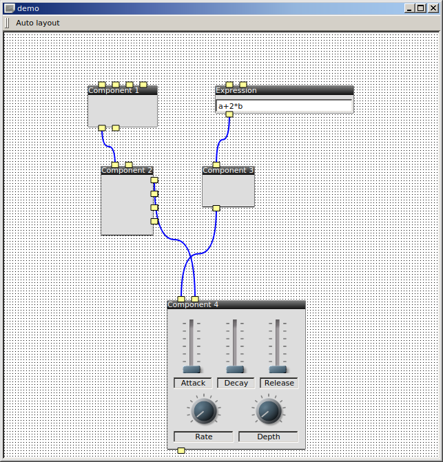

# patchwork
Qt5 widgets for building audio and signal processing graphs

This library provides a graphical editor for signal processing graphs.
Such graphs can be used for modular audio synthesis, or software radio systems.

The graph editing widget *PwArea* is built on Qt's Graphics View framework.

The concept is defined as follows:
- graphs are comprised of *nodes* and *connectors*
- nodes have inputs and ouputs, known as *endpoints*
- connectors link together pairs of endpoints, an input and an output, known respectively as a *target* and a *source* endpoint.

The nodes embed Qt widgets inside the graphics view, and they can be fully interacted with, by both keyboard and mouse.

Many features are implemented:
- automatic layout of nodes, using the Graphviz library
- ability to move, select, delete
- endpoint placement on top, bottom, left or right
- making items translucent to see connectors below
- useful widgets with features (slider, dial): labels, value displays, resettable, skinnable using freeware program JKnobman

